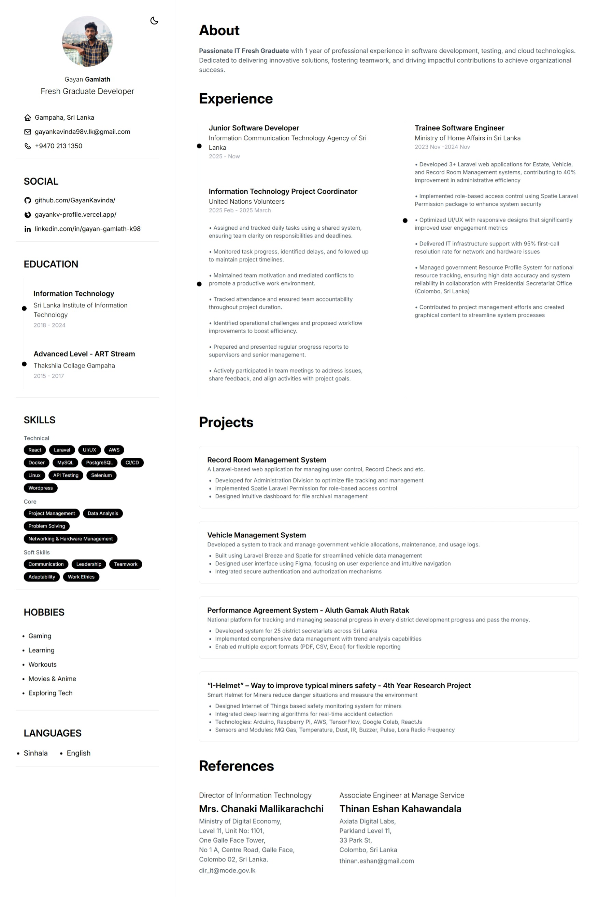

# 🚀 My Digital Resume (React + Vite)

This is a **modern digital resume** built with **React**, **Vite**, and **Tailwind CSS**. It's designed to be fast, responsive, and easy to customize.



## 🛠️ Tech Stack

- ⚛️ React 18.3.1
- 🚀 Vite 5.3.1
- 🎨 Tailwind CSS 3.4.4
- 🧩 Lucide React
- 🔠 PropTypes
- 🎨 React Icons
- 🔧 ESLint + React Hooks Plugin

## 📦 Installation

```bash
git clone https://github.com/GayanKavinda/My_Digital_Resume.git
cd My_Digital_Resume
npm install
npm run dev


## After you download this folder, open your terminal and type 'npm install' to install the dependencies.
